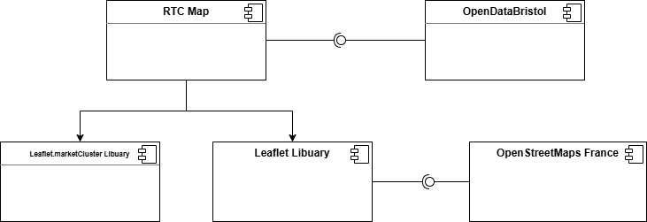
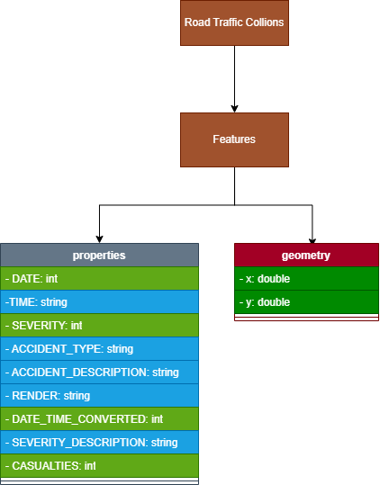
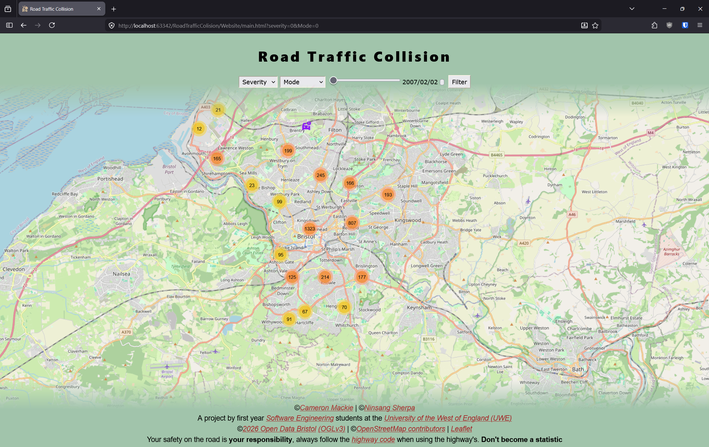
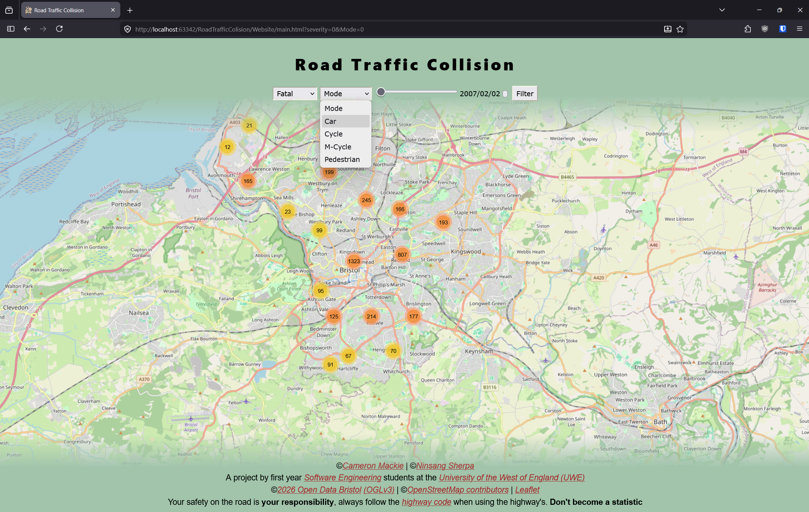
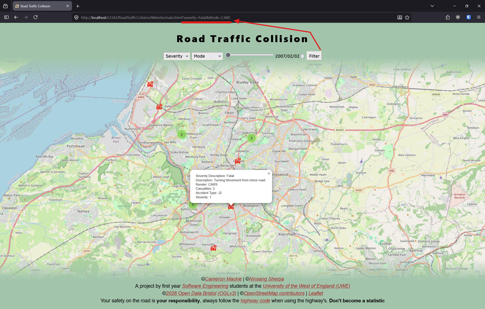

# Implementation

## Introduction
TODO: Describe the system implemented (Describe the dataset. Are there any known issues? Describe any configuration data).

<<<<<<< HEAD


In its current state this system shows a map of every Road Traffic Collision(RTC) with injury or fatality, that the police reported to Bristol city council.
=======
In its current state this system shows a map of every Road Traffic Collision(RTC) with injury or fatality, that the police reported to Bristol city council
>>>>>>> af87a99 (Document Revisions)
<br>The police do not necessarily attend every non-injury RTC as such they do not report RTC's with no injures. 
<br>It shows these using custom colour coded custom icons. 

| Mode/Render        | Icon                            |
|--------------------|---------------------------------|
| Car                |  |
| Cycle              |  |
| Motorcycle         |  |
| Adult pedestrian   |  |
| Child pedestrian   |  |
| Elderly pedestrian |  |


| Severity | Colour                             |
|----------|------------------------------------|
| Slight   |  |
| Serious  |  |
| Fatal    |  |

The system allows the use to filter the map to only show specific modes of transport (using the RENDER variable from OpenDataBristol) or only show a certain level of seriousness.
<br>e.g. (Seriousness: Fatal, Mode of transport: Car)

The system allows for users to click individual collisions to see more information about them. 

The system also groups pins together if they are to close, making the system perform better on lower end hardware and making it easier for users to understand the data. 


The system has gone through a number of stages in its development.
Some keypoints are below

| Commit (links)                                                                                                      | Description                                                                                                                                                                                                          | Version Number |
|---------------------------------------------------------------------------------------------------------------------|----------------------------------------------------------------------------------------------------------------------------------------------------------------------------------------------------------------------|----------------|
| [3bc44fd](https://github.com/Cameron-Programer/RoadTrafficColision/tree/3bc44fdb7ecb138ff894bfbbfcc20817d35a1271)   | This is the first version of the program that showed all the collisions on the map.<br> So this the point where the program was somewhat usable                                                                      | V0.1.0         |
| [4a20f20](https://github.com/Cameron-Programer/RoadTrafficColision/commit/4a20f201aa1408bf8475ae0bf8c4095a51c771cc) | This is the commit when the JS and CSS were moved out of the HTML file to make it easier to maintain <br> and allow for multiple people to work simultaniously on the program with lower chances of merge confilicts | V0.1.1         |
| [974d5da](https://github.com/Cameron-Programer/RoadTrafficColision/tree/974d5dab2a720094f800e082c1779f6e6e6bd3d8)   | This is the commit that added marker clustering,this resolved the issue where bristol was just a sea of pins when zoomed out.                                                                                        | V0.1.2         |
| [c593d14](https://github.com/Cameron-Programer/RoadTrafficColision/tree/c593d1471891970027cf9c1beb0cf6f9954a0c0e)   | This is the commit that allowed the user to select filters, making it easier for the data to be understood                                                                                                           | V0.2.0         |
| [2227f01](https://github.com/Cameron-Programer/RoadTrafficColision/tree/2227f014f80ee483e7b41793961a239d737b4c03)   | This is the commit that added the colour coded icons, to make the data easier to understand at a glance                                                                                                              | V0.2.1         | 


## Project Structure
```
RoadTrafficCollision:
├──   readme.md
|             
├── documentation templates
|   └── docs
|       ├── contribution.md
|       ├── design.md
|       ├── implementation.md
|       ├── planning.md
|       ├── requirements.md
|       ├── testing.md
|       |   
|       └── images
|           ├── class1.png
|           ├── component.png
|           ├── deployment.png
|           ├── mockup.png
|           ├── palette.png
|           ├── screenshot.png
|           ├── sequence.png
|           ├── use-case.png
|           ├── wireframe.png
|           |   
|           └── DrawioFiles
|               ├── CamWireframeA.png
|               ├── contextdiagram.drawio.png
|               ├── NinWireframeA.drawio.png
|               ├── UseCase.drawio.png
|               ├── UseCase2.drawio.png
|               └── [DRAFT]ComparisonDesign.drawio
|                   
└── Website
    ├── main.html
    ├── styles.css
    |   
    ├── images
    |   ├── icon.png
    |   |   
    |   └── mapMarkers  
    |       ├── aFat.png
    |       ├── aMin.png
    |       ├── aSrs.png
    |       ├── carsFat.png
    |       ├── carsMin.png
    |       ├── carsSrs.png
    |       ├── cFat.png
    |       ├── cMin.png
    |       ├── cSrs.png
    |       ├── cycFat.png
    |       ├── cycMin.png
    |       ├── cycSrs.png
    |       ├── eFat.png
    |       ├── eMin.png
    |       ├── eSrs.png
    |       ├── mcycFat.png
    |       ├── mcycMin.png
    |       ├── mcycSrs.png
    |       └── un.png
    |           
    └── scripts
        ├── map.js
        ├── obd-to-mapsc.js
        ├── odb-api.js
        ├── slidetimeupdater.js
        ├── start-map.js
        |   
        └── date selector
            └── unix-time-converter.js
                

```
TODO: provide a table listing the number of jslint warnings/reports for each module.

## Software Architecture
TODO: Describe the major components of your architecture. Are any particular architectural styles being used?


## Bristol Open Data API



TODO: Repeat as necessary

# User guide
TODO: Explain how each use-case works by providing step-by-step screenshots for each use-case. This should be based on a tested scenario.

### Filtering RTC's
By severity of the collision and by mode of transportation. 

Step 1
Load the site.



Step 2
Select the severity

You have 4 options, 
1) Severity (Default), this will not filter by severity (so all are included)
2) Fatal, this will only show RTC's that had a fatality. 
3) Serious, this will only show RTC's that were deemed to be serious by the police
4) Minor, this will only show RTC's that had injury but they were deemed to be minor by the police


Step 3
Select the mode of transport 
This is determined by using the RENDER var from the API, there may have been multiple modes involved in one RTC. 

This has 5 options 
1) Mode (Default), Includes all 
2) Car, Only shows RTC's where render is car 
3) Cycle, Only shows RTC's where render is bicycles
4) M-Cycle, only shows RTCS where render is motorcycle
5) Pedestrian, this only shows collisions where the render is a pedestrian. 


Step 4
Filter the map 

Now you press the filter button on the right, the URL will update to show the settings you have chosen. 
When this is updated the map will now only show the type you have chosen 

So for this example the map now only shows Fatal car crashes. 

