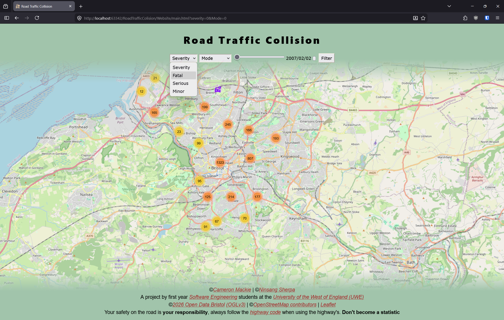

# Implementation

## Introduction
TODO: Describe the system implemented (Describe the dataset. Are there any known issues? Describe any configuration data).

## Project Structure
```
RoadTrafficCollision:
├──   readme.md
|             
├── documentation templates
|   └── docs
|       ├── contribution.md
|       ├── design.md
|       ├── implementation.md
|       ├── planning.md
|       ├── requirements.md
|       ├── testing.md
|       |   
|       └── images
|           ├── class1.png
|           ├── component.png
|           ├── deployment.png
|           ├── mockup.png
|           ├── palette.png
|           ├── screenshot.png
|           ├── sequence.png
|           ├── use-case.png
|           ├── wireframe.png
|           |   
|           └── DrawioFiles
|               ├── CamWireframeA.png
|               ├── contextdiagram.drawio.png
|               ├── NinWireframeA.drawio.png
|               ├── UseCase.drawio.png
|               ├── UseCase2.drawio.png
|               └── [DRAFT]ComparisonDesign.drawio
|                   
└── Website
    ├── main.html
    ├── styles.css
    |   
    ├── images
    |   ├── icon.png
    |   |   
    |   └── mapMarkers  
    |       ├── aFat.png
    |       ├── aMin.png
    |       ├── aSrs.png
    |       ├── carsFat.png
    |       ├── carsMin.png
    |       ├── carsSrs.png
    |       ├── cFat.png
    |       ├── cMin.png
    |       ├── cSrs.png
    |       ├── cycFat.png
    |       ├── cycMin.png
    |       ├── cycSrs.png
    |       ├── eFat.png
    |       ├── eMin.png
    |       ├── eSrs.png
    |       ├── mcycFat.png
    |       ├── mcycMin.png
    |       ├── mcycSrs.png
    |       └── un.png
    |           
    └── scripts
        ├── map.js
        ├── obd-to-mapsc.js
        ├── odb-api.js
        ├── slidetimeupdater.js
        ├── start-map.js
        |   
        └── date selector
            └── unix-time-converter.js
                

```
TODO: provide a table listing the number of jslint warnings/reports for each module.

## Software Architecture
TODO: Describe the major components of your architecture. Are any particular architectural styles being used?


## Bristol Open Data API
TODO: Document each query to Bristol Open Data


TODO: Repeat as necessary

# User guide
TODO: Explain how each use-case works by providing step-by-step screenshots for each use-case. This should be based on a tested scenario.

### Filtering RTC's
By severity of the collision and by mode of transportation. 

Step 1
Load the site.


Step 2
Select the severity
You have 4 options, 
Severity (Default), this will not filter by severity (so all are included)
Fatal, this will only show RTC's that had a fatality. 
Serious, this will only show RTC's that were deemed to be serious by the police
Minor, this will only show RTC's that had injury but they were deemed to be minor by the police



Step 3
Select the mode of transport 
This is determined by using the RENDER var from the API, there may have been multiple modes involved in one RTC. 

This has 5 options 
Mode (Default), Includes all 
Car, Only shows RTC's where render is car 
Cycle, Only shows RTC's where render is bicycles
M-Cycle, only shows RTCS where render is motorcycle
Pedestrian, this only shows collisions where the render is a pedetrian. 


Step 4
Filter the map 

Now you press the filter button on the right, the URL will update to show the settings you have chosen. 
When this is updated the map will now only show the type you have chosen 

So for this example the map now only shows Fatal car crashes. 

